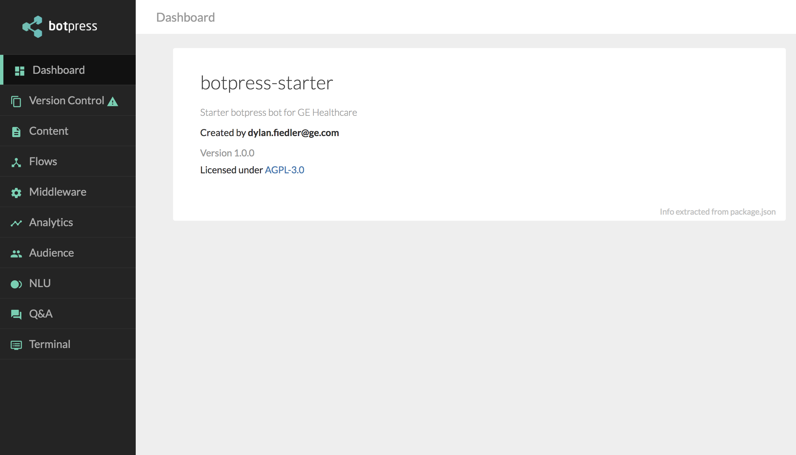

# Botpress Starter

  

This is a starter botpress application that includes numerous skills and built-in content types that can be reused and deployed on AWS, Heroku, or Predix.

## Installing and Running the Bot

Run `npm install && npm start` to install dependencies and start your bot.

By default bot runs locally with web interface available at http://localhost:3000

## Deploying to CloudFoundry

You can deploy to CloudFoundry by updating the provided [manifest.yml](./manifest.yml) file.

## Deploying to Heroku or AWS

Check [Heroku](https://botpress.io/docs/deploy/heroku/) and [AWS](https://botpress.io/docs/deploy/aws/) deploy tutorials to get started

## Development

To learn more on how to work with [Botpress](https://botpress.io/) you can read [here](https://botpress.io/docs/getting_started/).

## Training Videos

Additionally, training videos for creating content and adding features can be found on Box [here](https://ge.box.com/s/7b7rn9124f6qb775vebx77ku6asrk0a8).

## Botpress Contacts

Main contacts for Botpress:
    - Sylvain Perron - sylvain@botpress.io
    - Alex Pletnov - alex@botpress.io
